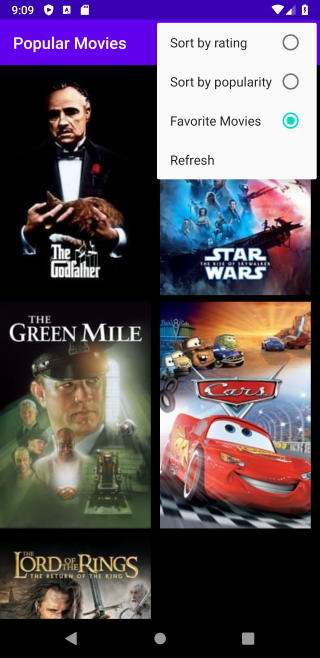
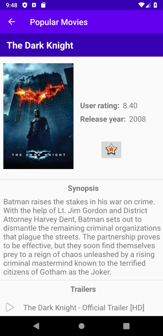
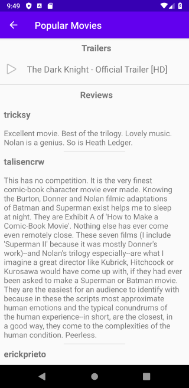

# Popular Movies
Popular Movies project for Android Developer Nanodegree Program from Udacity. The project is build in two stages. Movies data fetched using [TMDb](href="https://www.themoviedb.org/") API

## Screenshots

## Libraries used
- AndroidX
- Room
- LiveData
- ViewModel
- Picasso
- RecyclerView
- ConstraintLayout

## Stage 1 - Main Discovery Screen, A Details View, and Settings

Project requirments:

In this stage you’ll build the core experience of your movies app. Your app will:
- Upon launch, present the user with an grid arrangement of movie posters.
- Allow your user to change sort order via a setting:
  - The sort order can be by most popular, or by top rated
- Allow the user to tap on a movie poster and transition to a details screen with additional information such as:
  - original title
  - movie poster image thumbnail
  - A plot synopsis (called overview in the api)
  - user rating (called vote_average in the api)
  - release date

## Stage 2 - Trailers, Reviews, and Favorites

In this stage you’ll add additional functionality to the app you built in Stage 1.

You’ll add more information to your movie details view:
- You’ll allow users to view and play trailers ( either in the youtube app or a web browser).
- You’ll allow users to read reviews of a selected movie.
- You’ll also allow users to mark a movie as a favorite in the details view by tapping a button(star). This is for a local movies collection that you will maintain and does not require an API request*.
- You’ll modify the existing sorting criteria for the main view to include an additional pivot to show their favorites collection.
